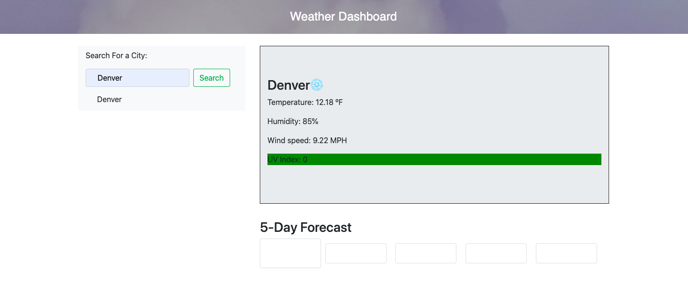
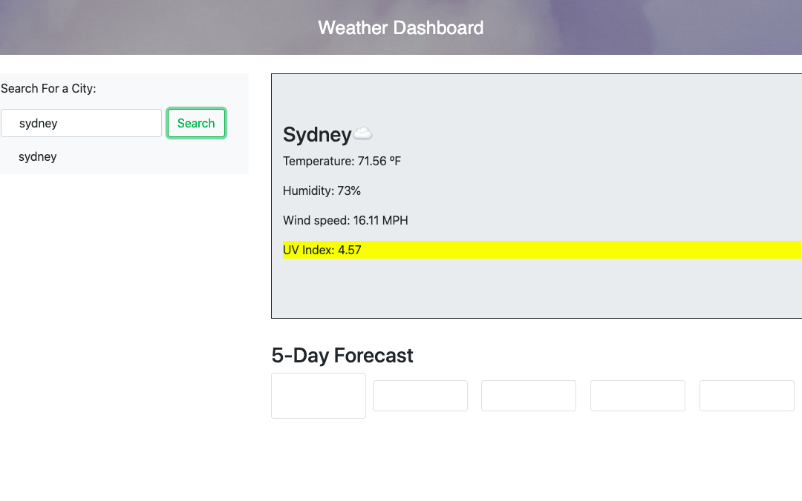

# WeatherDashboard

## Description
The purpose of this project is to let a user search for a city, and have the weather information of that city populate on the screen. The city name is stored in local storage, and appears in the drop down below the search bar. The weather information that appears is the city name, along with a dynamic emoji that changes based on the description of the weather, the temperature in Fahrenheit, the percentage of humidity, the wind speed in miles per hour, and the UV index. The UV index changes color based on its severity (low - green, moderate - yellow, high - red). Additionally, a 5 day forecast appears below the weather information to show a forecast of the city's weather over the course of the next five days. 

## Usage

### Link to Deployed Application
[Weather Dashboard]()
